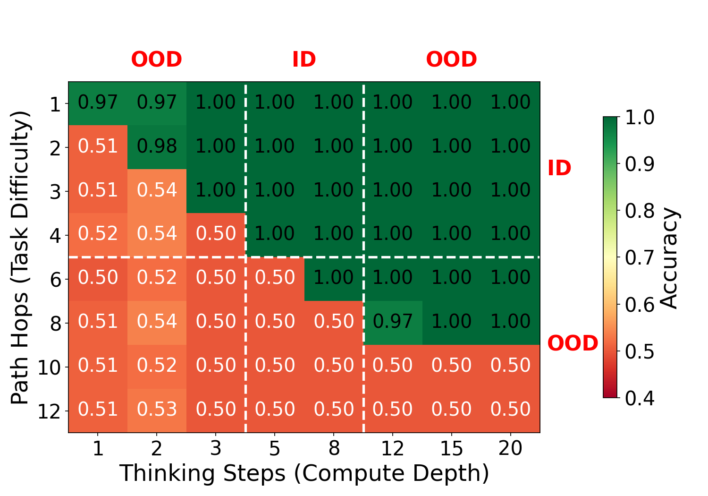
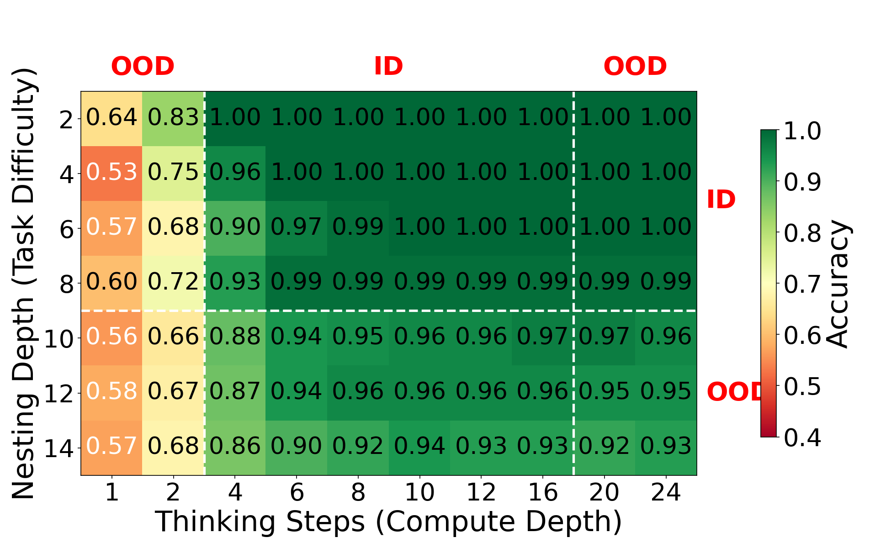
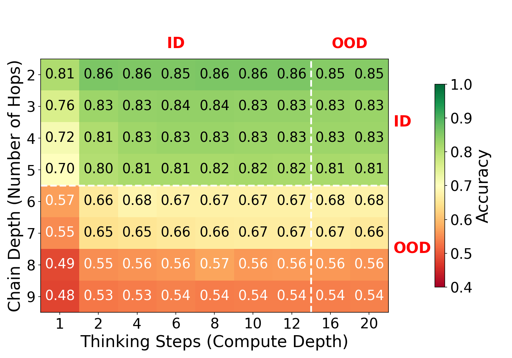
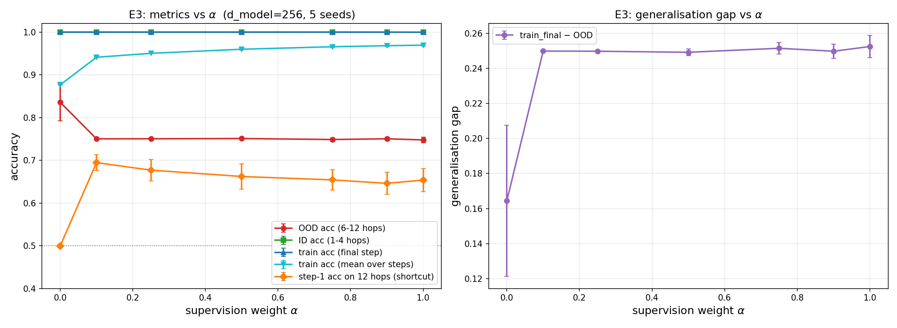
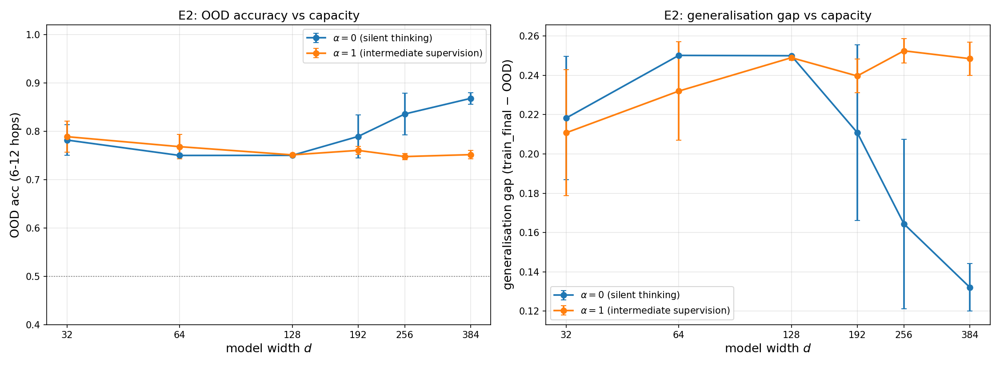

# Thinking Deeper, Not Longer: Memory-Efficient Test-Time Reasoning with Depth-Recurrent Transformers

Code and experiment artifacts for the paper *Thinking Deeper, Not Longer:
Memory-Efficient Test-Time Reasoning with Depth-Recurrent Transformers*
([arXiv:2603.21676](https://arxiv.org/abs/2603.21676)).

A standard Transformer has a fixed computational depth set at architecture time.
This project studies a **depth-recurrent Transformer** that decouples computational
depth from parameter count: a single shared-weight block is applied iteratively for
*T* steps in latent space, so the model can trade recurrence steps for deeper
reasoning at inference time ("thinking deeper"), without emitting any intermediate
tokens ("not longer").

Across three compositional-reasoning tasks we observe a consistent **computational
frontier**: a diagonal boundary in the (task difficulty x thinking steps) accuracy
grid where performance jumps from chance to near-perfect once enough steps are
allocated. The tasks differ in the inductive bias of their input interface, and
this produces qualitatively different out-of-distribution (OOD) behaviour:
precise-but-brittle (graph), approximate-but-robust (logic), and autonomous latent
routing with no structural hints (relational text).

## Architecture

```
input tokens -> embedding -> [ ThinkingBlock  x T steps ] -> readout head -> prediction
                                    ^ shared weights
```

The recurrent **ThinkingBlock** (one pre-norm Transformer block, applied *T* times):

- **Gated recurrence** `h <- z * h_new + (1 - z) * h_old`, with the update gate
  bias initialised to **-2.0** (`sigma(-2) ~ 0.12`), biasing the block toward
  keeping its previous state. This creates a near-identity path that keeps
  gradients healthy across 20+ unrolled steps.
- **Depth embeddings**: a learnable per-step vector added at each iteration so the
  block knows which step it is on.
- **Silent-thinking objective**: cross-entropy is computed **only at the final
  step**. The model is never supervised on intermediate steps, forcing it to learn
  a genuine multi-step algorithm rather than an early-exit heuristic.
- **Randomised step count**: *T* is sampled from a range each batch, so the model
  is robust across compute budgets and can be unrolled beyond its training range.
- **RoPE + LayerScale** (sequence tasks only): rotary positions for relative-order
  awareness, LayerScale (`gamma` init `1e-4`) to protect fragile symbolic states
  from untrained-block noise early in training. The graph task uses a hard
  adjacency mask instead and needs neither.
- **Readout head**: an MLP on the final state `H^(T)`. Graph concatenates the
  source and target node representations; the sequence tasks read the `[CLS]`
  position, so the core must route the answer there by the last step.

## Tasks

All three tasks are **binary classification**; difficulty is a single integer
(hop count / nesting depth / relation-chain length), and solving an instance
needs at least that many thinking steps.

| | `graph/` | `nested-expr/` | `family-reason/` |
|---|---|---|---|
| Problem | given a directed graph and two nodes `s`, `r`, decide whether a path `s -> r` exists | given a nested boolean expression such as `!((T&F)\|(!(T\|F)))`, decide whether it evaluates to `True` | given a shuffled bag of kinship facts and a queried relation between two entities, decide whether that relation is correct |
| Difficulty axis | path length (hops) | expression nesting depth | length of the parent/child relation chain |
| Input bias | adjacency-masked attention (1 step = 1 hop) | full attention + RoPE | full attention + RoPE, facts shuffled |
| `d` / heads / `d_ff` | 128 / 4 / 256 | 256 / 8 / 1024 | 256 / 8 / 1024 |
| RoPE / LayerScale | no / no | yes / yes | yes / yes |
| Train step range `T` / `T_max` | [5, 8] / 20 | [4, 16] / 28 | [1, 12] / 20 |
| Train -> eval difficulty | 1-5 -> 12 hops | depth 1-8 -> 14 | depth 2-5 -> 9 |

The `family-reason` task is CLUTRR-inspired but synthetic: the correct relation
is a signed offset over parent (`+1`) / child (`-1`) hops rather than literal
kinship semantics, and hard negatives share the offset parity of the true
answer, so the model must actually track the running sum rather than count
words. All models are under 1M parameters; the scale is deliberate, to isolate
the recurrence mechanism from pretraining confounds.

## Results

All three tasks show the same **computational frontier**: in the
(difficulty x thinking steps) grid, accuracy jumps from chance (~0.5, red) to
near-perfect (green) once the model is given at least as many thinking steps as
the instance is deep. Dashed lines mark the training range; everything outside
is out-of-distribution (OOD). Regenerate any figure below with the task's
`plot_results.py` / `plot_supervision_sweep.py` (no GPU needed).

**Experiment I -- graph reachability.** Adjacency masking makes the frontier a
sharp staircase (exactly one step per hop). Trained on 1-5 hops / 5-8 steps, the
model still solves 6- and 8-hop paths perfectly given enough steps and stays
stable out to 20 steps; at `d = 128` it hits a wall at 10 hops.



**Experiment II -- nested boolean logic.** RoPE only softly biases attention, so
the frontier is gradual and degradation is graceful: around 90% accuracy at
nesting depth 14 (1.75x the depth-8 training limit), with no collapse even at 24
thinking steps.



**Experiment III -- relational composition.** With the facts shuffled, position
carries no structural signal, so difficulty is strictly monotonic in chain
length. The core still discovers the latent pointer-chasing route, generalising
above chance to depth-6/7 chains (OOD) with extra thinking steps.



**Silent thinking vs. intermediate supervision** (`d = 256`, 5 seeds). Sweeping
the blend weight `alpha`: `alpha = 0` (silent thinking) is the only setting that
turns extra width into deeper propagation -- OOD accuracy ~0.84, generalisation
gap ~0.16. Any `alpha >= 0.1` drops OOD accuracy to ~0.75 and widens the gap to
~0.25, while *raising* per-step training accuracy and the Step-1 shortcut
(impossibly high 1-step accuracy on 12-hop paths). It is a switch, not a dial.



Across model width, silent thinking's OOD accuracy climbs with capacity while
intermediate supervision stays flat -- the extra parameters go into fitting the
intermediate readouts, not a deeper algorithm.



## Repository layout

```
graph/
  graph_experiment.py        Experiment I: train + full-grid eval + heatmap.
                             Flags: --per-step-loss (alpha=1 objective),
                             --emb-ablation, --seed.
  baselines.py               fixed-depth GNN / Graph Transformer /
                             Weight-Tied Transformer, same data + protocol
  ut_act.py                  genuine Universal Transformer with ACT halting +
                             ponder cost (graph); writes graph/act_results.json
  plot_results.py            rebuild the result heatmap (.pdf + .png, no retraining)
  supervision_sweep.py       one (alpha, d, seed) point of the silent-thinking
                             vs intermediate-supervision interpolation sweep
  plot_supervision_sweep.py  aggregate sweep_results/ -> summary table + figures
  sweep_results/             per-(alpha, d, seed) JSON from the sweep
nested-expr/
  logic_experiment.py        Experiment II (flags: --emb-ablation, --seed)
  plot_results.py
family-reason/
  family_experiment.py       Experiment III (flags: --seed)
  embedding_ablation.py      depth-embedding OOD-confound diagnostic (family)
  plot_results.py
seq_baselines.py             fixed-depth / Weight-Tied Transformer baselines for
                             the logic and family tasks
                             (python seq_baselines.py {logic,family} --full [--seed N])
ut_act_seq.py                genuine Universal Transformer with ACT halting +
                             ponder cost (logic, family); writes
                             <task>/act_results.json
                             (python ut_act_seq.py {logic,family} --full --seeds 42 43 44)
make_baseline_table.py       aggregate baseline_results.json + act_results.json
                             -> LaTeX rows (Weight-Tied + Universal Transformer
                             (ACT) + ours)
emb_ablation_common.py       shared code for the depth-embedding diagnostic
emb_ablation_report.py       aggregate the three embedding_ablation_results.json
inference_cost.py            measure peak memory + latency of the reasoning core
                             vs step count and batch size (GPU)
run_*.sh                     Slurm submission templates (see "Cluster runs")
```

Each task directory keeps its committed outputs: the result figure
(`<task>_results.pdf` / `.png`) and the accuracy grid behind it (an array
literal at the top of `plot_results.py`, plus `family_results.npy` for that
task), the trained checkpoint (see below), and the depth-embedding diagnostic's
outputs (`embedding_ablation_results.json`, `gate_stats.png`,
`embedding_ablation_summary.png`). The supervision-sweep figures under `graph/`
are regenerated by `plot_supervision_sweep.py` from `graph/sweep_results/`.

### Checkpoints

Every experiment script saves the trained model's `state_dict` to
`<task>_model.pt` when it finishes (seed 42; `--seed N` writes
`<task>_model_s<N>.pt`):

| file | size | produced by | role |
|---|---|---|---|
| `graph/graph_model.pt` | ~0.8 MB | `graph_experiment.py` | reference only -- the `--emb-ablation` run retrains from scratch |
| `nested-expr/logic_model.pt` | ~3.9 MB | `logic_experiment.py` | reference only |
| `family-reason/family_model.pt` | ~3.9 MB | `family_experiment.py` | **required input** -- `embedding_ablation.py` loads it and does not retrain |

`family-reason/embedding_ablation.py` is a complete worked example of
rebuilding the model with the right config and calling
`model.load_state_dict(torch.load("family_model.pt", map_location="cpu"))`.

## Setup

```bash
pip install -r requirements.txt   # torch>=2.0, numpy, matplotlib, networkx
```

The three training experiments need a CUDA GPU in practice (CPU works but is far
slower). The analysis and plotting scripts (`plot_results.py`,
`plot_supervision_sweep.py`, `emb_ablation_report.py`) are CPU-only and run in
seconds.

## Reproducing the results

Each experiment script generates its own data, trains, evaluates over the full
(difficulty x steps) grid, prints the table, and writes a plain heatmap of
*that* run. Run each from its own directory (outputs are written next to the
script):

```bash
cd graph         && python graph_experiment.py     # Experiment I:  graph reachability
cd nested-expr   && python logic_experiment.py      # Experiment II: nested boolean logic
cd family-reason && python family_experiment.py     # Experiment III: relational composition
```

The committed `<task>_results.pdf` / `.png` shown under [Results](#results) are
the styled figures; `plot_results.py` rebuilds them (no GPU) from the accuracy
grid stored as an array literal at its top. Compare your run's printed table
against that grid.

Each script takes `--seed N` (default 42). It always writes its accuracy grid
to `<task>_grid_s<N>.npy` (`family_results_s<N>.npy` for family; seed 42 also to
`family_results.npy`); non-default seeds write seed-suffixed checkpoints and
heatmaps and leave the canonical seed-42 files untouched. The paper's
`tab:baselines` "ours" row is the 3-seed mean over `--seed 42 43 44`
(`run_ours_seq_seeds.sh`); the graph "ours" cell instead comes from the 3-seed
silent-thinking (`alpha=0`, `d=128`) points of the supervision sweep.

**Baselines.** Fixed-depth and weight-tied models, trained under the identical
protocol, for the paper's baseline table:

```bash
# each task: seed 42 -> baseline_results.json, other seeds -> baseline_results_s<seed>.json
(cd graph && for s in 42 43 44; do python baselines.py --seed $s; done)
for s in 42 43 44; do python seq_baselines.py logic  --full --seed $s; done
for s in 42 43 44; do python seq_baselines.py family --full --seed $s; done

# genuine Universal Transformer (ACT halting + ponder cost) -> <task>/act_results.json
(cd graph && python ut_act.py --seeds 42 43 44)
python ut_act_seq.py logic  --full --seeds 42 43 44
python ut_act_seq.py family --full --seeds 42 43 44

python make_baseline_table.py             # aggregate (3-seed mean+/-std) -> LaTeX rows
```

`make_baseline_table.py` globs every per-seed result it can find -- weight-tied
and fixed-depth baselines from `baseline_results*.json`, the genuine Universal
Transformer from `<task>/act_results.json`, our own row from
`sweep_results/e1_a0_d128_s*.json` (graph) and `logic_grid_s*.npy` /
`family_results*.npy` (sequence tasks, written by `run_ours_seq_seeds.sh`) -- so
a single seed still works; the paper's table is the 3-seed mean, with `+/-` std
printed on the OOD column where it rounds to `>= 1`.  Slurm templates:
`run_graph_baselines_seeds.sh`, `run_seq_baselines_seeds.sh`, `run_ut_act.sh`,
`run_ours_seq_seeds.sh`.

**Inference cost** (paper's memory/latency figure):

```bash
python inference_cost.py    # GPU; writes inference_cost.{json,pdf,png}
```

**Silent thinking vs. intermediate supervision** (the paper's
*Silent Thinking vs. Intermediate Supervision* section).
The blended objective is
`L(alpha) = (1 - alpha) * CE(final step) + (alpha / T) * sum_t CE(step t)`,
so `alpha = 0` is silent thinking and `alpha = 1` is full per-step supervision.
Run the grid of `(alpha, d, seed)` points, then aggregate:

```bash
cd graph
python supervision_sweep.py --alpha 0 --d-model 256 --seed 42   # one point
# The full sweep (run_supervision_sweep.sh + run_supervision_sweep_d256.sh) covers
# alpha in {0, 0.1, 0.25, 0.5, 0.75, 0.9, 1.0}, d in {32, 64, 128, 192, 256, 384},
# with 3 seeds at d in {32,64,128} and 5 seeds at d in {192,256,384}.
python plot_supervision_sweep.py    # prints the summary table, writes the figures
```

**Depth-embedding OOD-confound diagnostic** (the paper's
*Depth-Embedding Extrapolation Is Not Confounded* analysis): checks that
beyond-training-range stability is not an artifact of untrained depth-embedding
rows, by re-evaluating each trained checkpoint with the untrained rows replaced
by zeros / clamping / re-initialisation.

```bash
(cd graph        && python graph_experiment.py --emb-ablation)
(cd nested-expr  && python logic_experiment.py --emb-ablation)
(cd family-reason && python embedding_ablation.py)
python emb_ablation_report.py       # summary table across the three tasks
```

## Cluster runs

The `run_*.sh` scripts are **Slurm submission templates**, not turn-key scripts.
Before submitting, edit:

- `#SBATCH -A YOUR_ACCOUNT` -> your allocation,
- `ENV_BIN=/path/to/your/conda/env/bin` -> your Python environment,
- partition / time / GPU lines for your site.

Then `mkdir -p slurm_logs` and `sbatch run_<name>.sh` from the repo root. The
scripts write per-run logs under `slurm_logs/` (git-ignored).

## Citation

```bibtex
@article{chen2026thinking,
  title   = {Thinking Deeper, Not Longer: Memory-Efficient Test-Time Reasoning
             with Depth-Recurrent Transformers},
  author  = {Chen, Hung-Hsuan},
  journal = {arXiv preprint arXiv:2603.21676},
  year    = {2026}
}
```

## License

Released under the MIT License. See [LICENSE](LICENSE).
